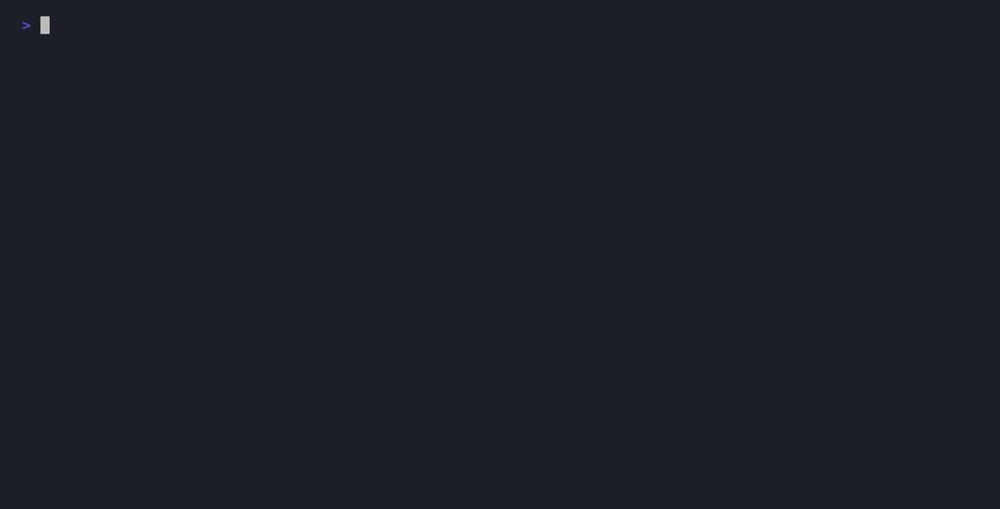

# 🤖 agents

> **Local multi-agent AI orchestration. Research → code → execute — fully automated, fully offline.**

[](https://github.com/vishwasvijayabaskar-code/agents/actions/workflows/test.yml)
[](pyproject.toml)
[](https://ollama.com)
[](LICENSE)

Built on LangGraph + LiteLLM + Ollama. No API keys required for local models. Runs entirely on your machine.



---

## What it does

Give it a task. It figures out which agent(s) to use, chains them together, and returns a result.

```
$ ./run "research the best Python async patterns in 2025, then write a production FastAPI server using them"

Orchestrator  decomposing task → 2 subtasks
RESEARCHER    searching + reading docs...
CODER         writing server using research findings...

[Full FastAPI server with async patterns, written to output/app.py]
```

**Agents collaborate mid-task.** CODER can delegate to RESEARCHER for API docs. Results inject back automatically.

```
$ ./run "write a script to upload files to the GitHub API"

CODER: I need the GitHub API upload spec first.
  → delegates to RESEARCHER: "GitHub API file upload endpoints"
  ← injects research result into code generation
CODER: [writes complete script using actual API docs]
```

---

## Architecture

```
ORCHESTRATOR  (qwen3:32b)         — routes, decomposes, chains, scores
    ├── FAST         (qwen2.5:7b)           — quick answers, summaries
    ├── CODER        (qwen2.5-coder:32b)    — code generation, web design
    ├── RESEARCHER   (deepseek-r1:14b)      — web search + page reading
    ├── EXECUTOR     (qwen2.5-coder:32b)    — runs shell commands, self-fixes
    ├── CLAUDE       (claude-sonnet-4-6)    — heavy reasoning, architecture
    ├── CODEX        (Codex CLI)            — autonomous multi-file builds
    └── SYNTHESIZE                          — merges multi-agent outputs
```

Plugins in `plugins/` register additional agents automatically.

---

## Key Features

### Autonomous task decomposition
Complex tasks split into subtasks automatically. Each agent's output pipes into the next.
```
"research X then build Y" → RESEARCHER → CODER (with research as context)
```

### Agent-to-agent delegation
Workers can request help from other agents mid-task without breaking flow.
```python
# CODER output triggers inline RESEARCHER call, result injected back
<delegate agent="RESEARCHER">Flask session management docs</delegate>
```

### Confidence-based escalation
Low-confidence FAST output auto-escalates to CODER, then CLAUDE. Heuristic pre-check skips LLM scoring for obvious cases.

### Cost budget enforcement
```yaml
limits:
  max_tokens_per_task: 50000  # hard stop, returns partial result
```

### Result caching
Semantically similar queries return cached answers (ChromaDB cosine distance < 0.15, 24h TTL).

### Plugin system
Drop a `.py` file in `plugins/`, implement `register()` — agent auto-loads at startup, orchestrator learns its description.

### Web UI
Live token streaming, session history, token usage charts, model hot-swap.

### MCP server
Expose agents as MCP tools for Claude Desktop or any MCP client.

---

## Quickstart

### 1. Install Ollama + pull models

```bash
brew install ollama  # or https://ollama.com
ollama serve

# Minimum viable (fast + cheap):
ollama pull qwen2.5:7b          # FAST agent
ollama pull qwen2.5-coder:32b   # CODER agent

# Full setup (adds research + orchestration):
ollama pull qwen3:32b
ollama pull deepseek-r1:14b
```

### 2. Install Python deps

```bash
pip install -r requirements.txt
```

### 3. Config (optional)

```bash
cp .env.example .env
# Only needed for CLAUDE agent (Anthropic API):
# ANTHROPIC_API_KEY=sk-ant-...
```

All other settings in `config.yaml` — models, token budgets, caching.

### 4. Run

```bash
./run "explain how Redis pub/sub works"
./run --route CODER "build a REST API for a todo app"
./run --route RESEARCHER "what changed in Python 3.13?"
./run  # REPL mode
```

---

## Usage

```bash
# One-shot (orchestrator auto-routes)
./run "write a sorting algorithm in Rust"

# Force specific agent
./run --route CODER "build a login page in Flask"
./run --route CLAUDE "architect a scalable microservices auth system"
./run --route RESEARCHER "compare React vs Vue in 2026"

# Multi-turn chat (follow-ups stay with same agent)
./run --chat "explain quicksort"

# REPL — interactive persistent session
./run

# With codebase context (agent reads your project)
./run --project ~/myproject "how does auth work here?"

# Resume a saved session
./run --resume 20240511_223000

# macOS notification when done
./run --notify "build me a Flask todo app"

# Today's token usage
./run --stats

# Index a codebase, then ask questions about it
./run --index ~/myproject
./run --project ~/myproject --route CODEBASE "where is the auth middleware defined?"

# File-watcher: drop files into watch/, agents process them automatically
./run --watch
#   watch/task.txt   → plain task
#   watch/job.task   → YAML {task, route, project}
#   watch/page.url   → fetch + summarize URL
#   watch/buggy.py   → code review
# Sample inputs live in examples/ — see examples/README.md
cp examples/task.txt watch/

# Run the eval/benchmark suite
./run --eval                # full suite
./run --eval coder fast     # filter by tags
python3 evals/runner.py --compare   # regression check vs last run
```

### REPL commands

| Command | Action |
|---------|--------|
| `exit` / `quit` | Save and exit |
| `history` | Show tasks this session |
| `save` | Save session now |
| `stats` | Token usage today |
| `models` | List models per agent |
| `/model <node> <model>` | Hot-swap model for a node |
| `/chat [task]` | Start multi-turn chat mode |

```
>>> /model coder ollama/deepseek-coder-v2:33b
coder → ollama/deepseek-coder-v2:33b
```

---

## Routing logic

| Input | Route |
|-------|-------|
| Short task, no multi-hop signal | Fast-pathed (no orchestrator LLM) |
| "research X and build Y", "step 1/step 2" | Decomposed into subtasks |
| Code task + "complex", "production", "architect" | CODER → CLAUDE escalation |
| Low confidence output from FAST | Auto-escalate to CODER |
| `--route <AGENT>` flag | Forced, skip orchestrator |

---

## Plugin system

```python
# plugins/my_agent.py
from helpers.plugins import PluginDefinition
from helpers.llm import _call_stream
from helpers.config import cfg

def my_node(state):
    model = cfg.model("fast")
    result = _call_stream(model, "You are a specialist.", state["task"], agent="MY_AGENT")
    state["agent_outputs"]["MY_AGENT"] = result
    state["result"] = result
    return state

def register():
    return PluginDefinition(
        name="MY_AGENT",
        node_fn=my_node,
        description="Does something specialized. Use when task involves X.",
    )
```

Orchestrator learns the description and routes to it automatically.

---

## Web UI

```bash
python3 web.py              # http://localhost:8000
python3 web.py --reload     # dev mode
python3 web.py --port 9000
```

Pages: `/` (run tasks), `/history`, `/stats`, `/models` (hot-swap), `/graph` (agent graph viz).

Live token streaming via SSE — tokens appear as the agent generates them.

---

## MCP Server

Expose agents as MCP tools for Claude Desktop or any MCP client:

```bash
python3 mcp_server.py         # stdio (Claude Desktop)
python3 mcp_server.py --sse   # SSE on port 8001
```

**Claude Desktop config** (`~/.claude/claude_desktop_config.json`):
```json
{
  "mcpServers": {
    "agents": {
      "command": "python3",
      "args": ["/path/to/agents/mcp_server.py"]
    }
  }
}
```

Tools: `run_task`, `search_memory`, `list_sessions`, `get_stats`, `list_models`

---

## Docker

```bash
docker compose up
# Web UI at http://localhost:8000
# Ollama at http://localhost:11434
```

Requires Ollama to have models pre-pulled (they're stored in the volume).

---

## Tests

```bash
pip install pytest pytest-mock
python3 -m pytest tests/ -v
```

209 tests. Covers routing, fast-path heuristics, confidence escalation, task decomposition, agent delegation, budget enforcement, codebase indexing, file-watcher, eval harness, synthesizer, plugins, config, executor security. No Ollama required (all LLM calls mocked).

---

## Project Structure

```
agents/
├── nodes/
│   ├── orchestrator.py  # routing, decomposition, delegation, confidence scoring
│   ├── coder.py         # code generation
│   ├── researcher.py    # DuckDuckGo + full-page fetch + summarization
│   ├── fast.py          # quick answers
│   ├── executor.py      # shell execution (deny-list, sandboxed to output/)
│   ├── codex.py         # Codex CLI subprocess
│   ├── claude.py        # Anthropic API / Claude Code CLI
│   └── synthesizer.py   # merges multi-agent outputs
├── helpers/
│   ├── llm.py           # LiteLLM streaming + token budget + thread-local ctx
│   ├── memory.py        # ChromaDB vector memory + result cache
│   ├── delegation.py    # <delegate> tag parser + executor
│   ├── search.py        # DuckDuckGo + page fetch + HTML stripper
│   ├── files.py         # code block → file output
│   ├── session.py       # session context + anaphora detection
│   ├── project.py       # codebase context loader
│   ├── usage.py         # token usage JSONL logger
│   ├── config.py        # config.yaml singleton + env-var override
│   └── plugins.py       # plugin loader
├── plugins/
│   └── translator.py    # example: TRANSLATOR agent
├── tests/               # 209 tests (no Ollama required)
├── web/
│   ├── app.py           # FastAPI + SSE task runner
│   └── templates/       # Jinja2 HTML
├── config.yaml          # models, limits, executor deny-list, researcher settings
├── state.py             # AgentState TypedDict
├── graph.py             # LangGraph StateGraph + plugin registration
├── main.py              # CLI + REPL + chat mode
├── mcp_server.py        # FastMCP server
├── web.py               # web UI launcher
└── run                  # ./run bash wrapper
```

---

## Why not LangChain / CrewAI / AutoGen?

| | agents | LangChain | CrewAI | AutoGen |
|---|---|---|---|---|
| Fully local (no API) | ✅ | ✅ | ⚠️ | ⚠️ |
| Task decomposition | ✅ | ⚠️ | ✅ | ✅ |
| Mid-task delegation | ✅ | ❌ | ❌ | ⚠️ |
| Fast-path (no LLM for simple tasks) | ✅ | ❌ | ❌ | ❌ |
| Token budget enforcement | ✅ | ❌ | ❌ | ⚠️ |
| Result caching | ✅ | ⚠️ | ❌ | ❌ |
| MCP server built-in | ✅ | ❌ | ❌ | ❌ |
| Plugin system | ✅ | ✅ | ⚠️ | ⚠️ |
| Web UI + live streaming | ✅ | ❌ | ❌ | ❌ |
| Lines of code | ~3k | >100k | ~20k | ~30k |

Main advantage: small, hackable, local-first. You can read and understand the whole codebase in an afternoon.

---

## Contributing

PRs welcome. Run `pytest tests/` before submitting — all 209 must pass.

## License

MIT
